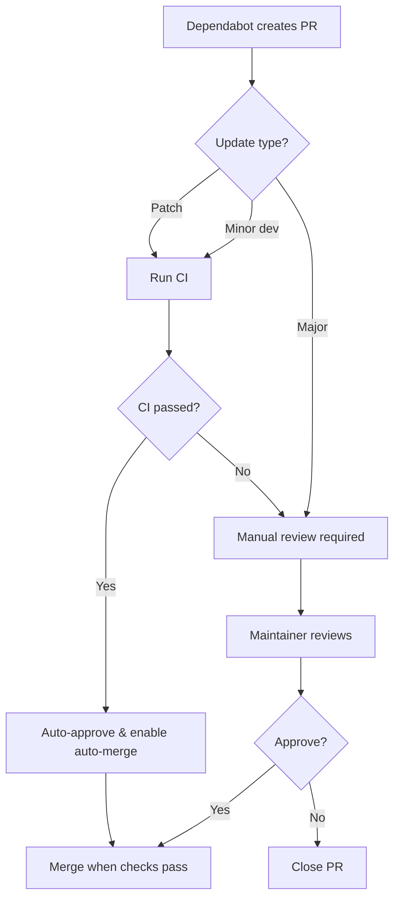

# Dependency Management & Security

## Overview

Automated dependency management using **Dependabot** with security scanning and auto-merge for safe updates.

## Table of Contents

1. [Dependabot Configuration](#dependabot-configuration)
2. [Auto-Merge Strategy](#auto-merge-strategy)
3. [Security Scanning](#security-scanning)
4. [Update Schedule](#update-schedule)
5. [Manual Review Process](#manual-review-process)

---

## Dependabot Configuration

### What is Dependabot?

Dependabot is GitHub's built-in dependency update service that:
- Automatically checks for dependency updates
- Creates pull requests for updates
- Prioritizes security vulnerabilities
- Groups related updates

### Configuration File

Location: `.github/dependabot.yml`

### Ecosystems Monitored

1. **Backend (npm)** - Root package.json
2. **Frontend (npm)** - web-interface/package.json
3. **GitHub Actions** - Workflow dependencies
4. **Docker** - Base image updates

---

## Auto-Merge Strategy

### Criteria for Auto-Merge

Updates are **automatically merged** when:

✅ **Patch updates** (e.g., 1.0.0 → 1.0.1)
- Bug fixes and security patches
- Very low risk of breaking changes

✅ **Minor dev dependency updates** (e.g., 1.0.0 → 1.1.0)
- TypeScript, ESLint, testing tools
- Don't affect production code

✅ **GitHub Actions updates**
- Workflow improvements
- Security fixes in CI/CD

✅ **All CI checks pass**
- Tests successful
- Build successful
- Linting passed

### Requires Manual Review

❌ **Major version updates** (e.g., 1.0.0 → 2.0.0)
- Likely breaking changes
- API changes
- Migration needed

❌ **Minor production dependency updates** (e.g., 1.0.0 → 1.1.0)
- May introduce new features/behavior
- Need testing in staging

❌ **Updates with failing CI**
- Build failures
- Test failures
- Must investigate before merging

### Workflow



---

## Security Scanning

### Enabled Security Features

1. **Dependabot Security Alerts**
   - Automatic vulnerability detection
   - Pull requests for security fixes
   - Severity ratings

2. **Dependency Graph**
   - Visual dependency relationships
   - Impact analysis

3. **Security Advisories**
   - Private vulnerability reporting
   - Coordinated disclosure

### Viewing Security Alerts

```bash
# GitHub CLI
gh api repos/:owner/:repo/vulnerability-alerts

# Or visit:
https://github.com/:owner/:repo/security/dependabot
```

### Security Update Priority

| Severity | Response Time | Action |
|----------|---------------|--------|
| **Critical** | Immediate | Auto-merge after CI |
| **High** | 24 hours | Review & merge ASAP |
| **Medium** | 7 days | Include in weekly updates |
| **Low** | 30 days | Batch with other updates |

---

## Update Schedule

### Weekly Schedule

| Day | Ecosystem | Time (UTC) |
|-----|-----------|------------|
| **Monday** | Backend npm | 06:00 |
| **Monday** | Frontend npm | 07:00 |
| **Tuesday** | GitHub Actions | 06:00 |
| **Wednesday** | Docker | 06:00 |

### Update Grouping

Related dependencies are grouped into single PRs:

**Backend Groups:**
- `backend-production` - Production dependencies
- `backend-dev` - Dev dependencies (@types/*, eslint, etc.)

**Frontend Groups:**
- `nextjs-ecosystem` - Next.js, React, React-DOM
- `frontend-ui` - UI libraries (Headless UI, Heroicons, etc.)
- `frontend-utils` - Utilities (axios, date-fns, etc.)
- `frontend-dev` - Dev dependencies

**Benefits:**
- Fewer PRs to review
- Related changes tested together
- Easier to track updates

---

## Manual Review Process

### When Manual Review is Needed

1. **Major version updates**
2. **Production dependency minor updates**
3. **Failed CI checks**
4. **Security updates requiring configuration changes**

### Review Checklist

```markdown
- [ ] Read changelog/release notes
- [ ] Check for breaking changes
- [ ] Review migration guide
- [ ] Test in local environment
- [ ] Deploy to staging
- [ ] Run integration tests
- [ ] Check production monitoring
- [ ] Update documentation if needed
- [ ] Approve and merge
```

### Testing Major Updates

```bash
# Create test branch
git checkout -b test/dependency-update

# Update dependency
npm install package@latest

# Run tests
npm test

# Build
npm run build

# Test locally
npm run dev

# If successful, update in Dependabot PR
```

---

## GitHub Configuration

### Required Settings

Enable in Repository Settings > Security:

1. ✅ **Dependabot alerts**
   - Settings > Security > Dependabot alerts

2. ✅ **Dependabot security updates**
   - Settings > Security > Dependabot security updates

3. ✅ **Dependabot version updates**
   - Configured via `.github/dependabot.yml`

### Branch Protection (Optional)

For main/master branch:
- Require status checks
- Require pull request reviews (optional for Dependabot)
- Allow auto-merge

---

## Troubleshooting

### Dependabot PR not created

**Check:**
1. Is Dependabot enabled? (Settings > Security)
2. Is `.github/dependabot.yml` valid?
3. Are there conflicting version constraints?
4. Check Dependabot logs (Settings > Insights > Dependency graph)

### Auto-merge not working

**Check:**
1. Is auto-merge enabled for the repo?
2. Did CI checks pass?
3. Does the PR meet auto-merge criteria?
4. Check workflow logs

### Too many Dependabot PRs

**Solutions:**
1. Increase grouping in `dependabot.yml`
2. Reduce `open-pull-requests-limit`
3. Adjust schedule to less frequent
4. Use `ignore` for specific dependencies

---

## Best Practices

### 1. Keep Dependencies Updated

```bash
# Check for outdated dependencies
npm outdated

# Update minor/patch versions
npm update

# Update major versions (carefully!)
npm install package@latest
```

### 2. Lock File Hygiene

```bash
# Backend (uses bun)
bun install --frozen-lockfile

# Frontend
npm ci
```

### 3. Audit Regularly

```bash
# Check for vulnerabilities
npm audit

# Fix automatically (if safe)
npm audit fix

# Fix with breaking changes (review first!)
npm audit fix --force
```

### 4. Monitor Dependabot Activity

```bash
# View recent Dependabot PRs
gh pr list --author "app/dependabot"

# View security alerts
gh api repos/:owner/:repo/dependabot/alerts
```

---

## Security Policy

See [SECURITY.md](./SECURITY.md) for:
- Vulnerability reporting process
- Security update SLAs
- Known security considerations
- Compliance requirements

---

## Related Documentation

- [SECURITY.md](./SECURITY.md) - Security policy
- [PERFORMANCE.md](./web-interface/PERFORMANCE.md) - Frontend performance
- [DISASTER_RECOVERY.md](./DISASTER_RECOVERY.md) - Backup & DR procedures

---

## Monitoring & Metrics

### Key Metrics to Track

1. **Update Latency**
   - Time from release to PR created
   - Time from PR created to merged

2. **Security Response Time**
   - Critical: <24 hours
   - High: <1 week
   - Medium: <1 month

3. **Update Success Rate**
   - % of updates that merge successfully
   - % requiring manual intervention

4. **Dependency Health**
   - Number of outdated dependencies
   - Number of security vulnerabilities
   - Average dependency age

---

**Last Updated:** 2025-01-19
**Maintainer:** DevOps Team
**Review Frequency:** Monthly
