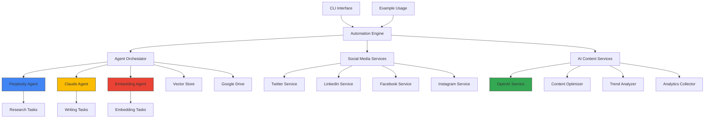

# System Architecture

## Overview

## Component Descriptions

### Agents
- **Perplexity Agent**: Specialized for research and real-time data gathering
- **Claude Agent**: Specialized for content creation and analysis
- **Embedding Agent**: Specialized for vector embeddings and semantic search

### Core Services
- **Agent Orchestrator**: Routes tasks to the most appropriate agent based on capabilities
- **Automation Engine**: Manages scheduling and automated workflows
- **Vector Store**: Supabase-based storage for semantic search capabilities
- **Google Drive**: Storage for reports and documents

### Social Media Services
- **Twitter Service**: Integration with Twitter API
- **LinkedIn Service**: Integration with LinkedIn API
- **Facebook Service**: Integration with Facebook API
- **Instagram Service**: Integration with Instagram API

### AI Content Services
- **OpenAI Service**: Content generation using GPT models
- **Content Optimizer**: Platform-specific content optimization
- **Trend Analyzer**: Analysis of trending topics
- **Analytics Collector**: Collection and analysis of platform metrics

### Interfaces
- **CLI Interface**: Command-line tools for system management
- **Example Usage**: Demonstration of system capabilities
